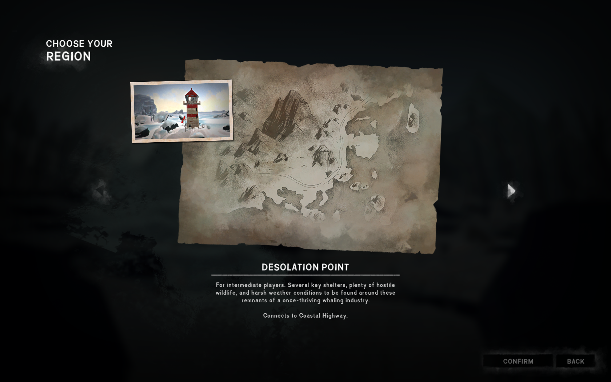
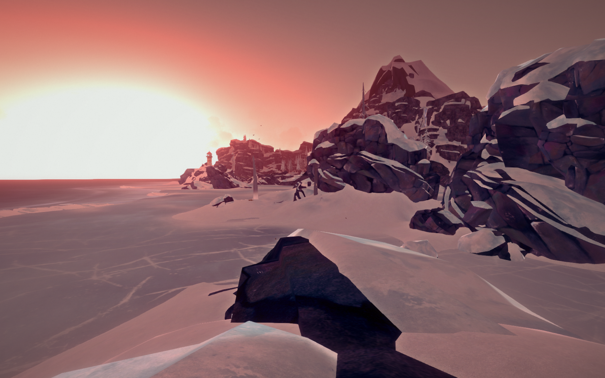

# InterloperRegionSelection

A small mod for The Long Dark that lets you select the spawn region when you start an Interloper mode game –
just like you could when starting a Pilgrim, Voyageur, Stalker, or custom mode game.

## Installation

1. If you haven't done so already, install the [Mod Loader](https://github.com/zeobviouslyfakeacc/ModLoaderInstaller)
2. Install the mod automatically by using [WulfMarius's Mod-Installer](https://github.com/WulfMarius/Mod-Installer/releases)

or

1. If you haven't done so already, install the [Mod Loader](https://github.com/zeobviouslyfakeacc/ModLoaderInstaller)
2. Download the latest version of `InterloperRegionSelection.dll` from the [releases page](https://github.com/zeobviouslyfakeacc/InterloperRegionSelection/releases)
3. Move `InterloperRegionSelection.dll` into the mods folder in your TLD install directory

## Instructions

1. Start a game in Interloper mode:

   
2. Select a starting region from the list:

   

   Selecting 'Random' results in the same spawn mode selection as in the unmodded game.
3. Select feats, choose a name for the save file, etc.
4. You spawn at an Interloper spawn point in the selected region:

   
